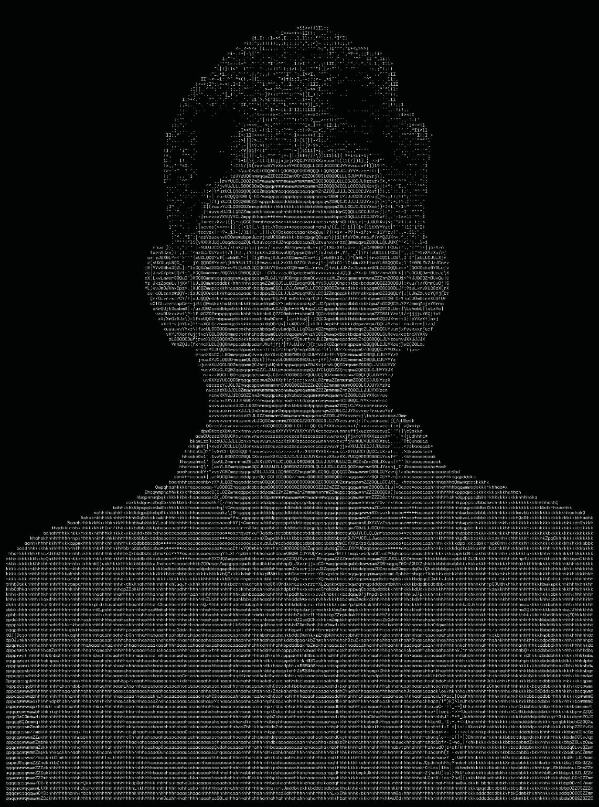

## Hi, I'm Sriram B 👋 Student Developer • Full-Stack Developer • AI Enthusiast
</div>

<table>
<tr>
<td width="42%" valign="top" align="center">



</td>
<td width="58%" valign="top">

```yaml
name: Sriram B
username: SRIRAM-B-CIT
location: India
role: Student Developer

education:
  college: Coimbatore Institute of Technology
  department: Information Technology

currently_learning:
  - Full-Stack Development
  - Artificial Intelligence
  - Cloud Computing
  - Mobile Application Development

programming:
  - Java
  - Python
  - JavaScript
  - TypeScript
  - C
  - C++

frontend:
  - HTML
  - CSS
  - React
  - Tailwind CSS

backend:
  - Node.js
  - Express
  - Spring Boot

database:
  - MySQL
  - Firebase
  - MongoDB

contact:
  email: srirambalaji770@gmail.com
  github: github.com/SRIRAM-B-CIT
  linkedin: linkedin.com/in/sriram-balaji-be
  portfolio: sriram-b-cit.github.io/SRIRAM_PORTFOLIO
```

</td>
</tr>
</table>

---
## 🌐 Connect With Me

<p align="center">

<a href="mailto:srirambalaji770@gmail.com">
  
</a>

<a href="https://github.com/SRIRAM-B-CIT">
  
</a>
<a href="https://www.linkedin.com/in/sriram-balaji-be/">
  
</a>
<a href="https://sriram-b-cit.github.io/SRIRAM_PORTFOLIO/">
  
</a>

</p>

## 🛠️ Tech Stack

<p align="center">
  
</p>

---

## 🚀 What I Do

- Build full-stack web applications
- Explore AI and cloud-based solutions
- Create practical projects for students and real-world users
- Learn and experiment with modern development tools

---

<div align="center">

### “Building useful projects and learning every day.”

</div>
